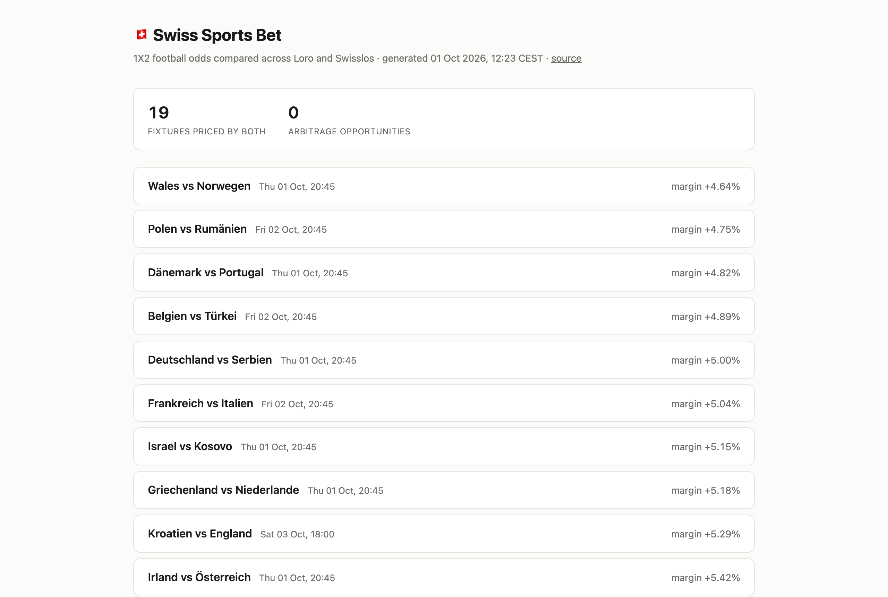

# 🇨🇭 Swiss Sports Bet Markets

> **Disclaimer:** This project is built for **educational and portfolio purposes only**. It is not intended for commercial use, real-money betting, or any activity that violates the terms of service of the data sources referenced. The scraping code is provided as a technical demonstration of web scraping, data engineering, and microservice architecture patterns.

A Python application that scrapes football (soccer) betting odds from Swiss bookmakers, links the same fixture across sources, and publishes a cross-bookmaker odds comparison with any arbitrage opportunities as a static page on GitHub Pages.

The whole thing runs on free infrastructure: GitHub Actions scrapes on a schedule, Supabase stores the odds, GitHub Pages serves the result.

**Live page: [tremgan.github.io/swiss-sports-bet](https://tremgan.github.io/swiss-sports-bet/)**, rebuilt every three hours.



## Project Status

The pipeline runs end to end: scrape, store, link fixtures across bookmakers, detect arbitrage, publish. A scheduled GitHub Actions workflow drives it every three hours and deploys the rendered page. Alembic manages the schema, and CI runs linting, type checking and 112 tests on every push.

## Architecture

Four services talk over HTTP, plus a shared library. Nothing outlives a run: the
scheduled job starts the API, scrapes into it, renders the page, and exits.

```
                  GitHub Actions, every 3 hours
+-----------------+   +----------------------+
|  Loro Scraper   |   |  Swisslos Scraper    |
|  (REST API)     |   |  (Playwright/WS)     |
+--------+--------+   +----------+-----------+
         |                       |
         |   POST /bookmaker_    |
         |   matches/ & odds/    |
         v                       v
      +-----------------------------+      +------------------+
      |       DB Service            |----->|  Supabase        |
      |  (FastAPI + SQLModel)       |      |  (PostgreSQL)    |
      |                             |<-----|                  |
      |  : stores bookmaker odds    |      +------------------+
      |  : links events across      |
      |    bookmakers on write      |
      |  : serves paired odds       |
      +--------------+--------------+
                     |
                     | GET /matches/with_odds/
                     v
              +--------------+      +----------------+
              |    Report    |----->|  GitHub Pages  |
              |   (Jinja2)   |      |  (index.html)  |
              +--------------+      +----------------+
```

### Services

**core** : Shared library. SQLModel data models, the arbitrage engine, the scrape/publish runtime both scrapers share, and one logging setup. Installed as an editable dependency via uv.

**loro_scrape_service** : Scrapes football betting odds from Loterie Romande (Loro), whose sportsbook runs on OpenBet. One `event-list` call returns fixtures and their 1X2 market together; the parser maps outcome `subType` (`H`/`D`/`A`) to odds, which is language-independent unlike the outcome names.

**swisslos_scrape_service** : Scrapes football betting odds from Swisslos by launching a headless Chromium browser via Playwright, intercepting WebSocket frames, and decompressing the binary (zlib-deflate) payloads to extract event and odds data.

**db_service** : FastAPI backend that stores all scraped data in a SQL database (SQLite locally, Supabase Postgres in production). Links each incoming bookmaker fixture to its canonical match as it is written, so there is no reconciliation step to run afterwards. Exposes endpoints for writing odds and reading paired cross-bookmaker odds.

**report** : Renders the paired odds as a dense odds board in one self-contained HTML file, with inline CSS and no scripts, which is what GitHub Pages serves. It reads the same `GET /matches/with_odds/` payload and calls `core.arbitrage`, so the published page and the API agree on what counts as an opportunity.

## Data Model

```
Match (canonical event)
|-- match_label          "FC Basel vs FC Zurich"
|-- match_datetime       2026-03-25 18:00 UTC
|-- team1, team2
|
+-- BookmakerMatch (one per bookmaker per match)
    |-- bookmaker        "Loro" / "Swisslos"
    |-- match_label      (may differ slightly between bookmakers)
    |-- match_datetime
    |
    +-- SportsBettingOdds (one per scrape run)
        |-- team1_odds
        |-- draw_odds
        |-- team2_odds
        +-- timestamp
```

An entity diagram is in [`docs/erd.html`](docs/erd.html).

## Cross-Bookmaker Matching

Loro and Swisslos disagree about how much of a club's name to write down: Swisslos reports "FC Thun vs Grasshopper Club Zurich" where Loro reports "Thun vs Grasshopper". Rather than score string similarity and pick a threshold, linking is deterministic.

Both feeds distinguish home from away — Loro tags the sides outright, Swisslos implies them by competitor order — and their kick-off times agree, so a fixture is identified by its normalised team pair at a kick-off:

1. Reduce each team name to the tokens that carry identity — lowercased, de-accented, stripped of club decoration (`FC`, `SC`, `Borussia`, founding years) and mapped through a small exonym table (`Cologne`→`Köln`, `Milano`→`Mailand`).
2. Compare only fixtures kicking off at the same time.
3. Two teams are the same when their squad qualifiers are equal (a women's or reserve side is never the senior side) and one's tokens contain the other's.
4. Both home **and** away must match.

`POST /bookmaker_matches/` resolves this inside the same transaction that stores the row, so a bookmaker match is never persisted in an unresolved state.

**Why the kick-off scope matters.** Token containment is only safe within a kick-off. Across a whole feed it merges genuinely different clubs — "AC Mailand" into "Inter Mailand", "AS Rom" into "Lazio Rom" — because `{mailand} ⊆ {inter, mailand}` is structurally identical to `{grasshopper} ⊆ {grasshopper, zurich}`, and the second must match. A club plays at most once at any given time, which is what makes the rule sound. Measured across 136 kick-off blocks of live data: zero ambiguous pairs.

When two canonical fixtures do both look plausible, the row is left unlinked rather than guessed at — a wrong link is permanent and silently corrupts the odds comparison, whereas an unlinked row is merely absent. Repair is `BettingRepository.merge_matches`, an explicit act; the scrapers re-post every fixture on every run, so a row refused once relinks itself on the next scrape.

## Arbitrage Detection

A bookmaker's own book always overrounds: its implied probabilities sum to more than 1, and the excess is its margin. Taking the *best* price for each outcome across several bookmakers can push that sum below 1, at which point a stake split proportional to the implied probabilities returns the same payout whichever way the match goes.

`core.arbitrage.analyse()` takes the `bookmaker_odds` payload from `GET /matches/with_odds/` and returns the best price per outcome, the combined margin, and — when the book is beatable — the stake split and guaranteed profit. Two-way markets (no draw priced) are handled as well as 1X2.

```python
>>> from core.arbitrage import analyse
>>> result = analyse({
...     "Loro":     {"team1_odds": 2.1, "draw_odds": 3.6, "team2_odds": 4.0},
...     "Swisslos": {"team1_odds": 1.8, "draw_odds": 3.5, "team2_odds": 5.0},
... })
>>> result.has_arbitrage, round(result.margin_pct, 2), round(result.profit_pct, 2)
(True, -4.6, 4.83)
>>> result.best_odds["team2"]
('Swisslos', 5.0)
```

## The Published Page

One row per fixture, sorted by how tight the combined book is, so anything
beatable sits at the top.

| Column | Shows |
|---|---|
| Fixture | Canonical match label and the matchday |
| Kick-off | Local Swiss time |
| 1 / X / 2 | The best price for that outcome across both bookmakers |
| Margin | Combined overround. Negative means arbitrage |

Opening a row reveals every bookmaker's price with the winning one marked, the
best price per outcome, and the stake split when the book is beatable.

The layout follows a financial terminal rather than a card feed: a fixed
numeric grid, tabular figures so digits line up column-wise, hairline rules,
and uppercase micro-labels. Nineteen fixtures fit on one screen, which matters
because comparing margins means reading them against each other.

Colour carries exactly one meaning each. Green marks an arbitrage, an amber dot
marks the bookmaker holding a best price, and everything else is greyscale.
There is no light theme: the palette was designed dark, and a second one would
be two palettes to maintain where only one was designed.

The file is self-contained. All CSS is inline and there are no scripts and no
external assets, because GitHub Pages serves it from a bare directory and a
page that half-loads is worse than a plain one. A test asserts this by
rejecting any `<script` or `src=` in the rendered output.

## Tech Stack

- Python 3.13, type-checked with pyright
- FastAPI + Uvicorn for the API layer
- SQLModel (SQLAlchemy + Pydantic) for ORM and validation
- Alembic for database migrations
- Playwright for headless browser automation and WebSocket interception
- rapidfuzz for fuzzy string matching across bookmakers
- Jinja2 for rendering the static report
- Supabase (hosted PostgreSQL) for storage, GitHub Pages for publishing
- uv for dependency management, ruff for linting and formatting
- GitHub Actions for CI and for running the scheduled pipeline

## Project Structure

```
swiss-sports-bet/
|-- Makefile                        # sync / lint / typecheck / test / check
|-- ruff.toml                       # lint + format config for the whole repo
|-- .env.example                    # copy to .env
|-- .github/workflows/
|   |-- test.yaml                   # lint, type check, test (per service)
|   +-- scrape.yaml                 # scheduled scrape, render and publish
|-- docs/
|   +-- erd.html                    # entity relationship diagram
+-- src/
    |-- core/
    |   |-- core/
    |   |   |-- models.py           # shared SQLModel data models
    |   |   |-- arbitrage.py        # arbitrage detection
    |   |   |-- scraper.py          # shared scrape/publish/reconcile runtime
    |   |   +-- logging_config.py   # one logging setup for all services
    |   +-- tests/
    |-- db_service/
    |   |-- main.py                 # FastAPI endpoints
    |   |-- repositories.py         # database access
    |   |-- config.py               # DB engine setup from env
    |   |-- migrations/             # Alembic
    |   +-- tests/
    |-- loro_scrape_service/
    |   |-- main.py                 # Loro (OpenBet) REST scraper
    |   +-- tests/                  # parser tests against a recorded fixture
    |-- swisslos_scrape_service/
    |   +-- main.py                 # Swisslos Playwright/WS scraper
    +-- report/
        |-- main.py                 # renders dist/index.html
        |-- templates/
        +-- tests/
```

Each service has its own `pyproject.toml` and `uv.lock`.

## Setup

### Prerequisites

- Python 3.13+
- [uv](https://docs.astral.sh/uv/)
- Chromium (installed by Playwright for the Swisslos scraper)

### Environment Variables

```bash
cp .env.example .env
```

| Variable | Used by | Purpose |
|---|---|---|
| `DATABASE_URL` | db_service, alembic | Connection string (`sqlite:///dev.db` locally, Supabase session pooler in production) |
| `DB_SERVICE_URL` | scrapers, report | Where to reach the API (default `http://127.0.0.1:8000`) |
| `SCRAPE_FREQUENCY_HOURS` | scrapers | Interval between runs when not using `--once` (default `3`) |

#### Connecting to Supabase

Copy the **session pooler** URI from the Supabase dashboard (Connect, port 5432)
and change its scheme to `postgresql+psycopg://`:

```
postgresql+psycopg://postgres.<project-ref>:<password>@<region>.pooler.supabase.com:5432/postgres?sslmode=require
```

Three details decide whether this works:

- The session pooler, not the direct connection. `db.<ref>.supabase.co` resolves
  to IPv6 only on the free tier, and GitHub Actions runners have no IPv6.
- Port 5432, not 6543. The transaction pooler drops session state between
  statements, which breaks `alembic upgrade head` and psycopg 3's prepared
  statements.
- The `postgresql+psycopg://` scheme. This project installs psycopg 3, so a bare
  `postgresql://` URI sends SQLAlchemy looking for psycopg2, which is absent.

Percent-encode any special characters in the password (`@` as `%40`, `:` as
`%3A`, `/` as `%2F`).

### Running Locally

1. Start the DB service:

```bash
cd src/db_service
uv sync
export DATABASE_URL=sqlite:///dev.db
uv run alembic upgrade head          # create/update the schema
uv run uvicorn main:app --reload
```

Interactive API docs are then at http://127.0.0.1:8000/docs.

2. Run the scrapers:

```bash
# Loro (quick, REST-based)
cd src/loro_scrape_service
uv sync
uv run main.py

# Swisslos (launches headless browser, takes ~90s per run)
cd src/swisslos_scrape_service
uv sync
uv run playwright install chromium --with-deps
uv run main.py
```

3. Render the report:

```bash
cd src/report
uv sync
uv run main.py ../../dist/index.html
```

Open `dist/index.html` in a browser. This is the same file the scheduled
workflow publishes.

Pass `--once` to either scraper to run a single pass and exit, which is what the
workflow does.

## Development

```bash
make sync        # uv sync every service
make lint        # ruff check + ruff format --check
make typecheck   # pyright, per service against its own venv
make test        # pytest, per service
make check       # all of the above
```

### Database migrations

The schema lives in `core.models` and is applied through Alembic:

```bash
cd src/db_service
uv run alembic revision --autogenerate -m "describe the change"
uv run alembic upgrade head
uv run alembic check                 # fails if models and migrations disagree
```

## CI/CD

`test.yaml` runs ruff over the whole repo, then type-checks and tests each
service in a matrix.

`scrape.yaml` is the pipeline. On a `17 */3 * * *` cron it installs db_service,
applies migrations against Supabase, starts the API on localhost for the length
of the job, runs both scrapers with `--once`, renders `dist/index.html`, and
deploys it to Pages.

A few things in it are deliberate:

- Each scraper is `continue-on-error`. One bookmaker being unreachable still
  leaves the other's prices worth storing.
- A guard step counts the fixtures priced by more than one bookmaker and fails
  the job at zero, so an empty page never replaces a good one.
- `concurrency` queues overlapping runs instead of cancelling them, letting a
  run that already holds the database finish.

It needs one repository secret, `DATABASE_URL`, holding the same session pooler
URI described above.

Both `schedule:` and `workflow_dispatch:` only fire from the default branch, so
changes to the pipeline have to reach `main` before they take effect.

### How the page gets deployed

`src/report` writes one self-contained `index.html` into `dist/`.
`upload-pages-artifact` uploads that directory, and a separate `publish` job
calls `deploy-pages` on it.

Pages is configured with `build_type: workflow`, so GitHub's CDN serves the
artifact directly. There is no `gh-pages` branch, and nothing in the repository
holds the built page (`dist/` is gitignored). Each run replaces the previous
deployment.

Deployment history is at
[/deployments](https://github.com/tremgan/swiss-sports-bet/deployments).

## API Endpoints

| Method | Path | Description |
|---|---|---|
| `GET` | `/` | Health check |
| `POST` | `/bookmaker_matches/` | Create a bookmaker match, or return the existing row on a repeat |
| `GET` | `/bookmaker_matches/` | List bookmaker matches (`limit`, `offset`) |
| `POST` | `/sports_betting_odds/` | Record a single odds snapshot |
| `POST` | `/sports_betting_odds/bulk/` | Record several odds snapshots in one transaction |
| `GET` | `/sports_betting_odds/` | List odds snapshots, newest first (`limit`, `offset`) |
| `GET` | `/matches/with_odds/` | Matches priced by more than one bookmaker (`limit`, `offset`) |

## Roadmap

- **Real-time alerts** : notify via Telegram or webhook when an arbitrage opportunity is detected
- **Additional bookmakers** : extend coverage beyond Loro and Swisslos
- **Historical odds tracking** : chart odds movement over time on the published page
- **Scraper parser tests** : record WebSocket/API fixtures and cover the parsing paths
