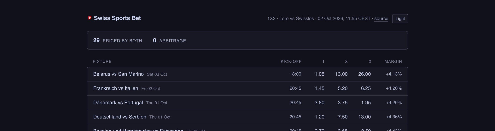
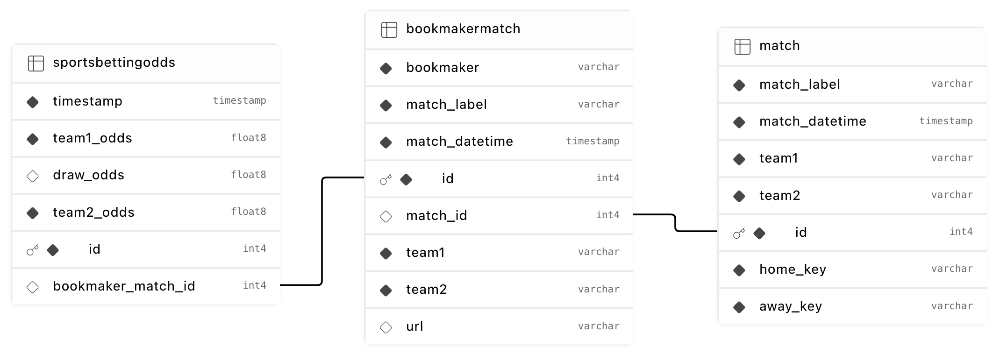

# 🇨🇭 Swiss Sports Bet Markets

A Python application that scrapes football (soccer) betting odds from Swiss bookmakers, links the same fixture across sources, and publishes a cross-bookmaker odds comparison with any arbitrage opportunities as a static page on GitHub Pages.

**[tremgan.github.io/swiss-sports-bet](https://tremgan.github.io/swiss-sports-bet/)**

<picture>
  <source media="(prefers-color-scheme: dark)" srcset="docs/report-dark.png">
  <source media="(prefers-color-scheme: light)" srcset="docs/report-light.png">
  
</picture>


## Architecture

Four services talk over HTTP, plus a shared library. Nothing outlives a run: the
scheduled job starts the API, scrapes into it, renders the page, and exits.

Scrapers are launched every 3 hours via a GitHub Actions workflow and post the data to `db_service`, which writes it to Supabase.

```
                  GitHub Actions, every 3 hours
+-----------------+   +----------------------+
|  Loro Scraper   |   |  Swisslos Scraper    |
|  (REST API)     |   |  (Playwright/WS)     |
+--------+--------+   +----------+-----------+
         |                       |
         |   POST /bookmaker_    |
         |   matches/ & odds/    |
         v                       v
      +-----------------------------+      +------------------+
      |       DB Service            |----->|  Supabase        |
      |  (FastAPI + SQLModel)       |      |  (PostgreSQL)    |
      |                             |<-----|                  |
      |  : stores bookmaker odds    |      +------------------+
      |  : links events across      |
      |    bookmakers on write      |
      |  : serves paired odds       |
      +--------------+--------------+
                     |
                     | GET /matches/with_odds/
                     v
              +--------------+      +----------------+
              |    Report    |----->|  GitHub Pages  |
              |   (Jinja2)   |      |  (index.html)  |
              +--------------+      +----------------+
```

### Services

#### core

The shared library: SQLModel data models, the arbitrage engine, the scrape/publish runtime both scrapers use, and one logging setup. uv installs it into each service as an editable dependency.

#### loro_scrape_service

Scrapes football betting odds from Loterie Romande (Loro), whose sportsbook runs on OpenBet. One `event-list` call returns fixtures and their 1X2 market together; the parser maps outcome `subType` (`H`/`D`/`A`) to odds, which is language-independent unlike the outcome names.

#### swisslos_scrape_service

Swisslos ships its odds over a WebSocket as raw deflate, so this one drives a headless Chromium through Playwright, intercepts the frames and inflates them.

#### db_service

FastAPI backend.

#### report

Renders the paired odds as one self-contained HTML file, then gets deployed to Github Pages.

## Data Model



`Match` is the canonical fixture, identified by its normalised team pair at a
kick-off. Each bookmaker contributes a `BookmakerMatch`, and every scrape appends a `SportsBettingOdds` row.

`match_id` is nullable on purpose. A `BookmakerMatch` the resolver cannot place
without guessing stays unlinked and relinks on a later run.

## Cross-Bookmaker Matching

Team names are not identical across bookmakers. Swisslos may report "FC Thun vs Grasshopper Club Zurich" where Loro reports "Thun vs Grasshopper". 

The matches are normalized as follows:
1. Reduce each team name to the tokens that carry identity: lowercased, de-accented, stripped of club decoration (`FC`, `SC`, `Borussia`, founding years) and mapped through a small exonym table (`Cologne` to `Köln`, `Milano` to `Mailand`).
2. Compare only fixtures kicking off at the same time.
3. Two teams are the same when their squad qualifiers are equal (a women's or reserve side is never the senior side) and one's tokens contain the other's.
4. Both home **and** away must match.

 What makes the rule sound is that a club plays at most once at any given time.


## Arbitrage Detection

A bookmaker's own book always overrounds: its implied probabilities sum to more than 1, and the excess is its margin. Taking the *best* price for each outcome across several bookmakers can push that sum below 1, at which point a stake split proportional to the implied probabilities returns the same payout whichever way the match goes.

`core.arbitrage.analyse()` takes the `bookmaker_odds` payload from `GET /matches/with_odds/` and returns the best price per outcome and the combined margin. When the book is beatable it also returns the stake split and the guaranteed profit. It handles two-way markets with no draw priced as well as 1X2.

```python
>>> from core.arbitrage import analyse
>>> result = analyse({
...     "Loro":     {"team1_odds": 2.1, "draw_odds": 3.6, "team2_odds": 4.0},
...     "Swisslos": {"team1_odds": 1.8, "draw_odds": 3.5, "team2_odds": 5.0},
... })
>>> result.has_arbitrage, round(result.margin_pct, 2), round(result.profit_pct, 2)
(True, -4.6, 4.83)
>>> result.best_odds["team2"]
('Swisslos', 5.0)
```


## Project Structure

```
swiss-sports-bet/
|-- Makefile                        # sync / lint / typecheck / test / check
|-- .env.example                    # copy to .env
|-- .github/workflows/
|   |-- test.yaml                   # lint, type check, test (per service)
|   +-- scrape.yaml                 # scheduled scrape, render and publish
|-- docs/
|   |-- schema.svg                  # schema diagram, exported from Supabase
|   |-- schema.png                  # the same diagram, rendered for the README
|   +-- report-*.png                # screenshot, one per theme
+-- src/
    |-- core/
    |   |-- core/
    |   |   |-- models.py           # shared SQLModel data models
    |   |   |-- arbitrage.py        # arbitrage detection
    |   |   |-- scraper.py          # shared scrape/publish/reconcile runtime
    |   |   +-- logging_config.py   # one logging setup for all services
    |   +-- tests/
    |-- db_service/
    |   |-- main.py                 # FastAPI endpoints
    |   |-- repositories.py         # database access
    |   |-- config.py               # DB engine setup from env
    |   |-- migrations/             # Alembic
    |   +-- tests/
    |-- loro_scrape_service/
    |   |-- main.py                 # Loro (OpenBet) REST scraper
    |   +-- tests/                  # parser tests against a recorded fixture
    |-- swisslos_scrape_service/
    |   +-- main.py                 # Swisslos Playwright/WS scraper
    +-- report/
        |-- main.py                 # renders dist/index.html
        |-- templates/
        +-- tests/
```

Each service has its own `pyproject.toml` and `uv.lock`.

## Setup

### Prerequisites

- [uv](https://docs.astral.sh/uv/)
- Chromium (installed by Playwright for the Swisslos scraper)

### Environment Variables


| Variable | Used by | Purpose |
|---|---|---|
| `DATABASE_URL` | db_service, alembic | Connection string (`sqlite:///dev.db` locally, Supabase session pooler in production) |
| `DB_SERVICE_URL` | scrapers, report | Where to reach the API (default `http://127.0.0.1:8000`) |
| `SCRAPE_FREQUENCY_HOURS` | scrapers | Interval between runs when not using `--once` (default `3`) |

#
### Running Locally

1. Start the DB service:

```bash
cd src/db_service
uv sync
export DATABASE_URL=sqlite:///dev.db
uv run alembic upgrade head          # create/update the schema
uv run uvicorn main:app --reload
```

Interactive API docs are then at http://127.0.0.1:8000/docs.

2. Run the scrapers:

```bash
# Loro (quick, REST-based)
cd src/loro_scrape_service
uv sync
uv run main.py

# Swisslos (launches headless browser, takes ~90s per run)
cd src/swisslos_scrape_service
uv sync
uv run playwright install chromium --with-deps
uv run main.py
```

3. Render the report:

```bash
cd src/report
uv sync
uv run main.py ../../dist/index.html
```

Open `dist/index.html` in a browser. This is the same file the scheduled
workflow publishes.

Pass `--once` to either scraper to run a single pass and exit, which is what the
workflow does.

## Development

```bash
make sync        # uv sync every service
make lint        # ruff check + ruff format --check
make typecheck   # pyright, per service against its own venv
make test        # pytest, per service
make check       # all of the above
```

### Database migrations

The schema lives in `core.models` and is applied through Alembic:

```bash
cd src/db_service
uv run alembic revision --autogenerate -m "describe the change"
uv run alembic upgrade head
uv run alembic check                 # fails if models and migrations disagree
```

## CI/CD

`test.yaml` runs ruff over the whole repo, then type-checks and tests each
service in a matrix.

`scrape.yaml` is the pipeline. On a `17 */3 * * *` cron it installs db_service,
applies migrations against Supabase, starts the API on localhost for the length
of the job, runs both scrapers with `--once`, renders `dist/index.html`, and
deploys it to Pages.

A few things in it are deliberate:

- Each scraper is `continue-on-error`. One bookmaker being unreachable still
  leaves the other's prices worth storing.
- A guard step counts the fixtures priced by more than one bookmaker and fails
  the job at zero, so an empty page never replaces a good one.
- `concurrency` queues overlapping runs instead of cancelling them, letting a
  run that already holds the database finish.

It needs one repository secret, `DATABASE_URL`, holding the same session pooler
URI described above.

Both `schedule:` and `workflow_dispatch:` only fire from the default branch, so
changes to the pipeline have to reach `main` before they take effect.

### How the page gets deployed

`src/report` writes one self-contained `index.html` into `dist/`.
`upload-pages-artifact` uploads that directory, and a separate `publish` job
calls `deploy-pages` on it.

Pages is configured with `build_type: workflow`, so GitHub's CDN serves the
artifact directly. There is no `gh-pages` branch, and nothing in the repository
holds the built page (`dist/` is gitignored). Each run replaces the previous
deployment.

Deployment history is at
[/deployments](https://github.com/tremgan/swiss-sports-bet/deployments).

## API Endpoints

| Method | Path | Description |
|---|---|---|
| `GET` | `/` | Health check |
| `POST` | `/bookmaker_matches/` | Create a bookmaker match, or return the existing row on a repeat |
| `GET` | `/bookmaker_matches/` | List bookmaker matches (`limit`, `offset`) |
| `POST` | `/sports_betting_odds/` | Record a single odds snapshot |
| `POST` | `/sports_betting_odds/bulk/` | Record several odds snapshots in one transaction |
| `GET` | `/sports_betting_odds/` | List odds snapshots, newest first (`limit`, `offset`) |
| `GET` | `/matches/with_odds/` | Matches priced by more than one bookmaker (`limit`, `offset`) |

## Roadmap

- Alert over Telegram or a webhook when an arbitrage shows up, rather than
  waiting for someone to open the page
- Cover more bookmakers than Loro and Swisslos
- Chart how the odds moved, now that every scrape is kept rather than overwritten
- Record more WebSocket and API fixtures, so the parsers are covered the way the
  matching logic is
